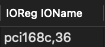
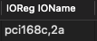

# Restoring Atheros WiFi Functionality on macOS Monterey, Ventura, and Sonoma
##### This is not tested with Seqouia.

> [!Note]
> OpenCore Legacy Patcher does not officially support being run on non-Apple Hardware.
> 
>  macOS only has a limited support for Atheros cards — Airport-related features do not work, and only few models can only be used for WiFi.

Currently confirmed working cards:
* AR9565
* AR9287
* AR9485

### 1. Kernel
Download, and add these kexts in your OC/Kexts folder, and make sure they are reflected in config.plist.

* [**corecaptureElCap.kext**](https://github.com/dortania/OpenCore-Legacy-Patcher/tree/main/payloads/Kexts/Wifi)
* [**IO80211ElCap.kext**](https://github.com/dortania/OpenCore-Legacy-Patcher/tree/main/payloads/Kexts/Wifi)
  * This kext has kexts within its Plugins folder, keep **AirportAtheros40.kext** and delete the rest.

 Set their **MinKernel** to `18.0.0` 
* [**AMFIPass.kext**](https://github.com/dortania/OpenCore-Legacy-Patcher/tree/main/payloads/Kexts/Acidanthera)
  * This will partially re-enable AMFI, it can be handy if you'll run into permission issues due to disabled AMFI.
  * This also allows the system to boot without the `amfi=0x80` boot-arg after root-patches are applied.

 Set **MinKernel**: `20.0.0`

### 2. Device Properties

| Key*   | Value      |   Type |
|--------|------------|--------|
| IOName |  | String |
| compatible|  | String |
| device-id |  | Data |

* These are used to spoof to one of the cards listed inside **AirportAtheros40**'s Info.plist. **IOName** helps OCLP detect "**Legacy Wireless**"

Atheros cards listed inside **AirportAtheros40**'s **Info.plist**:
||`IOName` and `compatible`|`device-id`|Note|
|-|-|-|-|
|AR93xx Wireless Network Adapter| pci168c,30 | 30000000 | Used in iMac12,x |
|AR928X Wireless Network Adapter| pci168c,2a | 2A000000 | Used in iMac11,x |
|| pci106b,0086 | 00860000 ||  
|AR242x / AR542x Wireless Network Adapter | pci168c,1c | 1C000000 ||
|AR5416 Wireless Network Adapter | pci168c,23 | 23000000 ||
|AR5418 Wireless Network Adapter| pci168c,24 | 24000000 ||

Example:
* AR9287 has an IOName of `pci168c,2e`, can set its `IOName` and `compatible` to `pci168c,2a`, and its `device-id` to `2A000000`.
  
* AR9485 with an IOName `pci168c,32`, can set its `IOName` and `compatible` to `pci168c,30`, and its `device-id` to `30000000`.

You can actually choose **any** from the list,  just choose the closest one.

### 3. Misc 

- Set Secure Boot Model to `Disabled`.
     - Changing the secure boot status requires an NVRAM reset, or variables retained can cause issues with IMG4 verification in macOS.
       - According to [Khronokernel](https://github.com/mrlimerunner/sonoma-wifi-hacks?tab=readme-ov-file#pre-root-patching)
 
### 4. NVRAM

Add the following NVRAM parameters under `Add` and `Delete`:

| Key*   | Value      |   Type |
|--------|------------|--------|
| boot-args | amfi=0x80 ipc_control_port_options=0 | String |
| csr-active-config | 03080000 | Data | 

- `ipc_control_port_options=0`: workaround if you run into issues with Electron based apps after disabling SIP, ie: *Discord*, *Google Chrome*, *VS Code*.
- `amfi=0x80`: disables AMFI, required in order for OCLP to appply root patches.
-  `csr-active-config` of `03080000` sets SIP (System Integrity Protection) to a reduced state.


Once the changes have been applied, reboot, reset your NVRAM, and OpenCore Legacy Patcher should now show the option to apply root patches.


# Supplemental Guide: Assigning an ACPI Name

### Issue Overview
If you have already followed the guide above, but OCLP does not prompt a "**Legacy Wireless**", then your Wifi card is not enumerated in ACPI at all. OpenCore can only overwrite properties for named devices in ACPI.

#### Example:
In this case, it ends with `pci168c,36`, which tells us it's **unnamed** (not a four letter name), the `IOName` we try to inject/spoof is **not** applied.


If it has a name such as `ARPT`(has a four letter name), the `IOName` we try to inject/spoof is applied.


### Assign an ACPI Name

1. Download, and run Hackintool
2. Identify PCI Path, and Debug value
* Navigate to the PCIe tab. Identify your WiFi card and note its ACPI path and debug values. For instance:


**`PCI0`**<sup> @0 /</sup> **`RP04`**<sup> @1C,3 /</sup> pci168c,36<sup> @0</sup>
* Path: PCI0.RP04 - actually the ACPI path for it's parent/PCI Bridge
* Debug: 02 00 0


Download the sample SSDT, and edit it according to your values:

```asl
DefinitionBlock ("", "SSDT", 2, "ARPT", "WIFIPCI", 0x00001000)
{
    External (_SB_.PCI0.RP04, DeviceObj)  // Replace "PCI0.RP04" with your WiFi's parent/PCI Bridge ACPI path

    Scope (_SB.PCI0.RP04)  // Replace "PCI0.RP04", same as above
    {
        Device (ARPT) // We assign a name for "pci168c,36" as "ARPT", "ARPT" is the ACPI name of WiFi card in Macs.
        {
            Name (_ADR, 0x02000000) // Add your debug value here, e.g., "02 00 0" becomes 0x02000000, `00 1C 4` becomes 0x001C40000
        }
    }
}
```

Save the edited SSDT file and add it to your OpenCore ACPI folder. Ensure your config.plist is updated to include the new SSDT by adding it to the ACPI section of your config.plist.

After restart, in my case, **PCI0**<sup> @0 /</sup> **RP04**<sup> @1C,3 /</sup> `pci168c,36`<sup> @0</sup> would now be **PCI0**<sup> @0 /</sup> **RP04**<sup> @1C,3 /</sup>`ARPT`<sup> @0</sup>

Before:

After:


You can now see the `IOName` is properly injected/spoofed. OCLP will now recognize the spoofed `IOName` of an iMac11,x Atheros card - of which OCLP supports.

|Before|After|
|-|-|
|||

Open the OCLP app, then apply root patches.

# Other Important Notes: 
- Remove `amfi=0x80` in your boot-args after applying root patched with OCLP, `AMFIPass.kext` will allow systems with patched root volume to boot without this boot arg.
- Once your root volume has been patched, SIP must remain at least partially disabled, or you will not be able to properly boot your system.
- Delta updates are unavailable to root-patched systems. Updates will show as the full 12GB+ installers. If necessary, you can revert your patches and update, then re-apply them, but do so at your own risk.
* Alternatively, you could use chunnann's patched <a href="https://www.insanelymac.com/forum/topic/312045-atheros-wireless-driver-os-x-101112-for-unsupported-cards/?do=findComment&comment=2509900">AirPortAtheros40.kext </a> 10.11.x (El Capitan). If using it, make sure to:
  * Delete <code>CodeSignature</code> and <code>Version.plist</code>
  * Open <code>Info.plist</code>, find <code>com.apple.iokit.IO80211Family</code>, and replace it with <code>com.apple.iokit.IO80211ElCap</code>

Credits:
* MrLimeRunner's [sonoma-wifi-hacks](https://github.com/mrlimerunner/sonoma-wifi-hacks/blob/main/README.md) guide.
* [PG7](https://www.insanelymac.com/forum/topic/359007-wifi-atheros-monterey-ventura-sonoma-work/) for the idea
* [Chunnan](https://www.insanelymac.com/forum/topic/312045-atheros-wireless-driver-os-x-101112-for-unsupported-cards/?do=findComment&comment=2509900) patches from ATH9Fixup
* [Dortania](https://github.com/dortania/OpenCore-Legacy-Patcher/tree/main/payloads/Kexts/Wifi) for patched IO80211ElCap.kext
* [Alejandro](https://github.com/aleelmaitro/Hackintosh-Atheros-Wi-Fi-Legacy-Cards) information in regards of which `device-id` is appropriate for specific Atheros Wireless Card.
