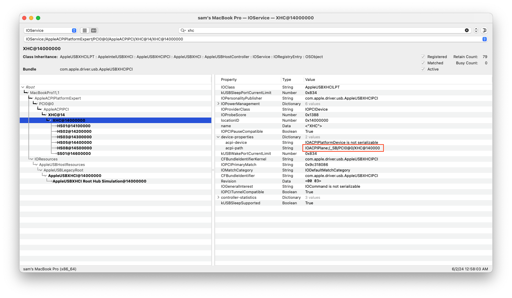
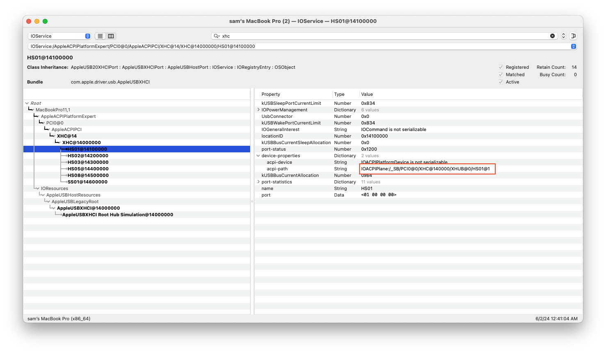

# Mapping USB ports via ACPI without Replacement table

> [!NOTE]  
> ⚠️ Disclaimer: This guide is not written by a developer, proceed at your own risk. It is still recommended to map USB using tools such as [USBMap](https://github.com/corpnewt/USBMap), or [USBToolBox](https://github.com/USBToolBox/tool). 

Advantage of this method compared to other known methods:

* macOS independent!
* No dropping of SSDT
* No _UPC to XUPC rename! 🎉

### Overview

For Broadwell and older, USB ports are enumerated in DSDT. Each USB port is enumerated under USB Root Hub `RHUB` for (eXtensible Host Controller), and `HUBN` for EHC (Enhanced Host Controller). Each port has a `_UPC` method, which indicates whether the port is **active** and specifies its **type**. 

```asl
// Example:

Device (HS01) // The USB Port HS01
{
    Name (_ADR, One) 
    Name (_STA, 0x0F) 

    Method (_UPC, 0, Serialized)  
    {
        Name (UPCP, Package (0x04)
        {
            0xFF, // 0xFF = On , Zero = Off
            0x03, // USB port type
            Zero,
            Zero 
        })
        Return (UPCP)
    }
}
```

The following values for USB port types are possible:

|   Value    | Port Type                            |
| :--------: | ------------------------------------ |
| **`0X00`** | USB Type `A`                         |
| **`0x01`** | USB `Mini-AB`                        |
| **`0x02`** | USB Smart Card                       |
| **`0x03`** | USB 3 Standard Type `A`              |
| **`0x04`** | USB 3 Standard Type `B`              |
| **`0x05`** | USB 3 `Micro-B`                      |
| **`0x06`** | USB 3 `Micro-AB`                     |
| **`0x07`** | USB 3 `Power-B`                      |
| **`0x08`** | USB Type `C` (USB 2 only)            |
| **`0x09`** | USB Type `C` (with Switch)           |
| **`0x0A`** | USB Type `C` (w/o Switch)            |
| **`0xFF`** | Internal (e.g, Bluetooth and Camera) |

Information regarding `_UPC` can be found in [ACPI Specification](https://uefi.org/sites/default/files/resources/ACPI_Spec_6_5_Aug29.pdf), ≈ p. 570. 

## Approach

In order to build our own USB port map via SSDT, we will do the following:

1. **Rename USB Controller** if needed. Such as `XHC1` to `SHCI`.
2. **Disable the `RHUB` (XHC Controller' Hub) and/or `HUBN` (EHC Controller's Hub):** This disables the `_UPC` methods under each port of the hub.
3. **Add `XHUB` and/or `HUBX` as Replacements:** Replace `RHUB` with `XHUB` and `HUBN` with `HUBX`.
4. **Assign the `_ADR` of the Original Hubs:** `XHUB` takes over the address of `RHUB`, and `HUBX` for `HUBN`.
5. **Enumerate active ports and assign `_ADR`:** Identify the active ports, and enumerate them under these new hubs. Add `_ADR` of each active port taken from the original ports from `RHUB` and/or `XHUB`.
6. **Adjust `_UPC` of Active Ports**

## Renaming USB Controller

Certain USB controllers needs to be renamed. Refer to the Dortania's [OpenCore Install Guide](https://dortania.github.io/OpenCore-Post-Install/usb/system-preparation.html#checking-what-renames-you-need).
	

* **XHC1 to SHCI**

| Key            | Type    | Value        |
| :------------- | :------ | :----------- |
| Comment        | String  | XHC1 to SHCI |
| Count          | Number  | 0            |
| Enabled        | Boolean | YES          |
| Find           | Data    | 58484331     |
| Limit          | Number  | 0            |
| Replace        | Data    | 53484349     |
| Skip           | Number  | 0            |
| TableLength    | Number  | 0            |
| TableSignature | Data    |              |

* **EHC1 to EH01**

| Key            | Type    | Value        |
| :------------- | :------ | :----------- |
| Comment        | String  | EHC1 to EH01 |
| Count          | Number  | 0            |
| Enabled        | Boolean | YES          |
| Find           | Data    | 45484331     |
| Limit          | Number  | 0            |
| Replace        | Data    | 45483031     |
| Skip           | Number  | 0            |
| TableLength    | Number  | 0            |
| TableSignature | Data    |              |

* **EHC2 to EH02**

| Key            | Type    | Value        |
| :------------- | :------ | :----------- |
| Comment        | String  | EHC2 to EH02 |
| Count          | Number  | 0            |
| Enabled        | Boolean | YES          |
| Find           | Data    | 45484332     |
| Limit          | Number  | 0            |
| Replace        | Data    | 45483032     |
| Skip           | Number  | 0            |
| TableLength    | Number  | 0            |
| TableSignature | Data    |              |

### Prerequisite

1. Must already know the active ports 
2. Rename USB Controller

> [!IMPORTANT]  
> If your USB controller's name needs a rename, **apply** it, then **restart** before proceeding to next part. 

#### 1. USB Controller's Hub ACPI-path



 IOACPIPlane:/`_SB`/`PCI0`@0/`XHC`@14000000

* USB ports of XHC/SHCI are enumerated under its `RHUB`.
  * `_SB.PCI0.XHC.RHUB` 
* USB ports of EHC/EH01/EH02, are enumerated under its `HUBN`. 
  * ex: `_SB.PCI0.EH01.HUBN` 

#### 2. `_ADR` of each port 


**HS01** : IOACPIPlane:/`_SB`/`PCI0`@0/`XHC`@14000000/`RHUB`@0/`HS01`@`1`
* HS01 is under `RHUB`, and is @`1`
* Convert decimal `1` to hex, we get `01`: `Name (_ADR, 0x01)`

**HS02** : IOACPIPlane:/`_SB`/`PCI0`@0/`XHC`@14000000/`RHUB`@0/`HS02`@`2`
* HS02 is under `RHUB`, and is @`2`
* Convert decimal `2` to hex, we get `0`2: `Name (_ADR, 0x02)`

##### Now do that for each active ports.

> [!NOTE]  
> Some ports may function as internal hubs and will have ports under them. Treat each internal hub port distinct from its child ports. For instance, if PR01 is an (internal) hub port with a child port PR11 (USB 2.0), you should list PR01 and PR11 as separate ports.

#### 3. Download the [`SSDT-USBMAP.dsl`](SSDT_USB_Mapping/SSDT_USBMAP.dsl) and adjust it accordingly.

> [!WARNING]  
> This SSDT cannot co-exist with SSDT-USB-Reset generated by USBMap, and  SSDT-RHUB.

```asl
DefinitionBlock ("", "SSDT", 2, "USBMAP", "USB_MAP", 0x00001000)
{
    External (_SB_.PCI0.EH01.HUBN, DeviceObj)
    External (_SB_.PCI0.EH02.HUBN, DeviceObj)
    External (_SB_.PCI0.EHC_.HUBN, DeviceObj)
    External (_SB_.PCI0.SHCI.RHUB, DeviceObj)
    External (_SB_.PCI0.XHC_.RHUB, DeviceObj)

    Scope (\_SB.PCI0.EH01.HUBN)  // Referencing HUBN of EH01 in DSDT.
    {
        Method (_STA, 0, NotSerialized)  
        {
            If (_OSI ("Darwin")) // if macOS
            {
                Return (Zero) // Disable HUBN
            }
            Else
            {
                Return (0x0F) // Enable for other OS
            }
        }
    }
    
	/*
		For XHC/SHCI, you need to disable RHUB.
		Scope (\_SB.PCI0.XHC.RHUB)
	*/

    Device (\_SB.PCI0.EH01.HUBX) // Add `HUBX` `Device`
    {
        Name (_ADR, Zero)  // Giving the address of the HUBN to the HUBX. RHUB or HUBN always have it `Zero`.
        Method (_STA, 0, NotSerialized)  
        {
            If (_OSI ("Darwin")) // if macOS
            {
                Return (0x0F) // Enable HUBX
            }
            Else
            {
                Return (Zero) // Disable HUBX for other OS
            }
        }
    }

	/*
		For XHC/SHCI, add a new device named `XHUB` 
		Device (\_SB.PCI0.XHC.XHUB).
	*/
    

    Device (\_SB.PCI0.EH01.HUBX.PR01) // Under HUBX, we add Port such as PR01
    {
        Name (_ADR, One)  // Each port has unique _ADR, here is where we add the converted HEX 
        Method (_UPC, 0, Serialized)  
        {
            Return (Package (0x04)
            {
                0xFF, // PR01's active
                0xFF, // It's Internal
                Zero,
                Zero
            })
        }
    }
    
   	 /*
   		 Append if there are another port.
   	 */
    

    Device (\_SB.PCI0.EH01.HUBX.PR01.PR11) // Some ports may also be a HUB. In this case, PR01 is. Under PR01, there is PR11
    {
        Name (_ADR, One) // _ADR of PR11 under PR01
        Method (_UPC, 0, Serialized)       
        {
            Return (Package (0x04)
            {
                0xFF, // It's Active
                0x00, // It's USB 2.0
                Zero, 
                Zero
            })
        }

    }
        /*
		Append if there are another port under this HUB port.
        */
}

```

## Notes

* I lack the understanding of the `_PLD` method. However, if you want it, you can return the original `_PLD` from your DSDT.
```asl
External (_SB_.PCI0.EH01.HUBN.PR01._PLD, MethodObj) // Referencing the _PLD method of PR01 from DSDT. 

Scope (\_SB.PCI0.EH01.HUBX.PR01) // Referencing the new HUBX's PR01 port
{
	Method (_PLD, 0, Serialized)  // Physical Location Device
	{
		Return (\_SB.PCI0.EH01.HUBN.PR01._PLD ()) // Return _PLD data from the HUBN's PR01 in DSDT to HUBX's PR01.
	}
}
```
* I cannot guarantee that this is a "one size fits all" method.
* `_PLD` does exist in ACPI of actual macs, but I am not sure if macOS actually uses it. AFAIK they use kext to map their USB.
* The idea of `_STA`ing, and re-assigning `_ADR` was inspired by SSDT-USB-Reset generated by USBMap, and  SSDT-RHUB.
* This guide lacks information regarding the 3rd Byte in the `_UPC` method for USB-C port (capabilities), please refer to the ACPI Specification.
* Information in this guide is based from ACPI Specification, and [5T33Z0's ACPI USB Mapping guide](https://github.com/5T33Z0/OC-Little-Translated/tree/main/03_USB_Fixes/ACPI_Mapping_USB_Ports).
* If USBToolBox.kext + UTBMap.kext, or USBMap.kext are present/turned on in your config, this USB mapping will be ignored by macOS.
* This SSDT is **not necessary**, but useful if you want to share your config and prefer having USBMap.kext. USBMap.kext is SMBIOS dependent, if someone tries your config and changes the SMBIOS, this SSDT will be the fallback USB Map.
